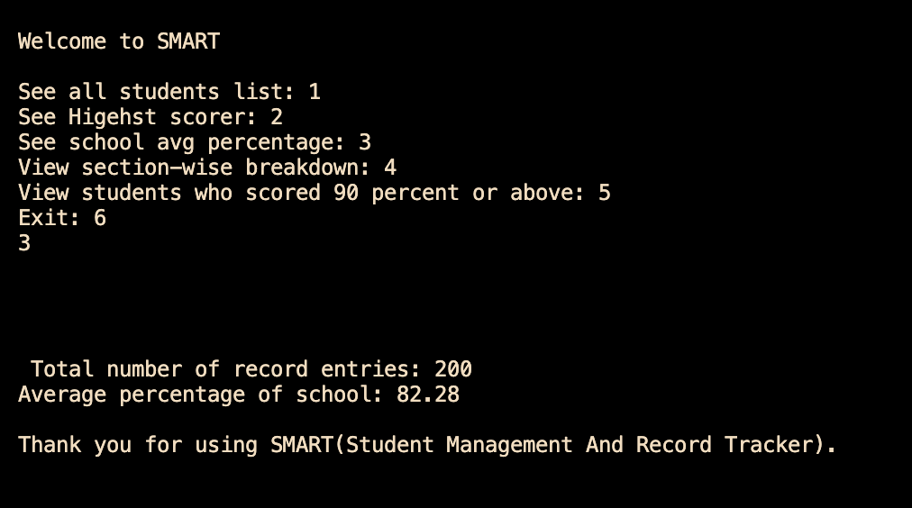

🎓 SMART - Student Management And Record Tracker

## 📷 Preview

  

  

A command-line Student Management System built entirely in C Programming that reads student records from a CSV-formatted text file and performs useful academic analysis such as finding the highest scorer, calculating the school average, filtering students section-wise, and identifying students who scored 90% or above.

This project was created to strengthen my understanding of Structures, File Handling, Functions, Arrays, Strings, and CSV Parsing through practical implementation.

⸻

✨ Features

* 📋 View all student records
* 🏆 Display the highest-scoring student
* 📊 Calculate the overall school average percentage
* 🏫 Filter students by section
* ⭐ Display students scoring 90% or above
* 📈 Count high scorers in every section
* 📂 Read records directly from a CSV-based dataset
* 🖥️ Interactive menu-driven interface

⸻

🛠 Technologies Used

* C Programming
* Structures (struct)
* Functions
* Arrays
* Strings (string.h)
* File Handling
* CSV Parsing
* Standard C Library

⸻

📂 Dataset Format

The application reads data from a file named records.txt.

Example:

Aarav Sharma,10th A,95.60
Priya Verma,10th B,91.20
Rohan Singh,10th C,88.40

Each record follows the format:

Student Name,Class Section,Percentage

⸻

📸 Program Menu

1. View All Students
2. View Highest Scorer
3. View School Average Percentage
4. View Section-wise Breakdown
5. View Students Scoring 90% or Above
6. Exit

⸻

🧠 Concepts Practiced

This project helped me gain hands-on experience with:

* Modular Programming
* Structures
* File Handling
* CSV Parsing
* Arrays
* String Manipulation
* Searching Through Records
* Menu-driven Applications

⸻

📁 Project Structure

SMART/
│
├── smart.c
├── records.txt
└── README.md

⸻

🚀 Future Improvements

* ➕ Add Student Records
* ✏️ Edit Existing Records
* ❌ Delete Student Records
* 🔍 Search Student by Name
* 🏅 Rank Students by Percentage
* 📊 Sort Records
* 📈 Section-wise Average Percentage
* 📚 Top 5 Performers
* ⚠️ Better Error Handling
* ✅ Input Validation

⸻

🎯 Learning Outcomes

While building SMART, I strengthened my understanding of:

* Reading structured data from files
* Organizing code using functions
* Working with structures
* Processing CSV datasets
* Building menu-driven console applications
* Performing basic data analysis in C

⸻

👨‍💻 Author

Harshvardhan Jha

📌 Computer Science Engineering Student

📌 Learning C through project-based development.

If you liked this project, consider giving the repository a ⭐.
